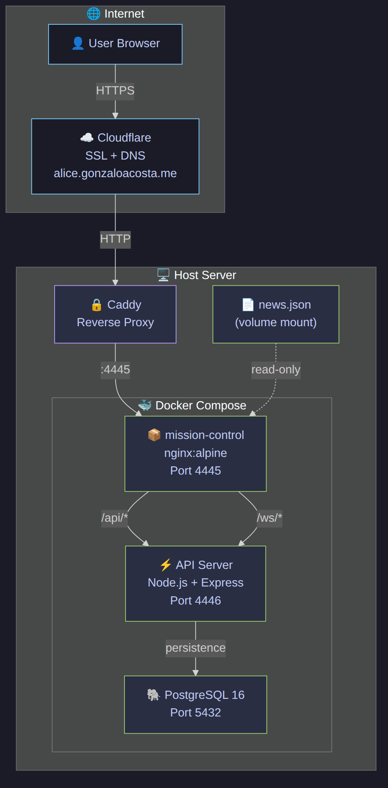
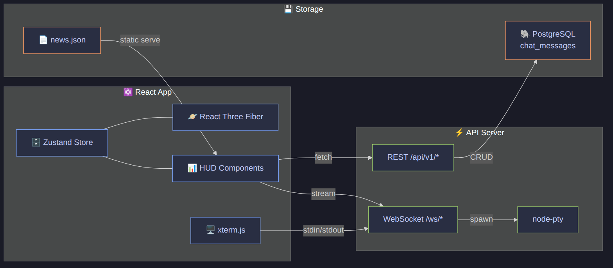
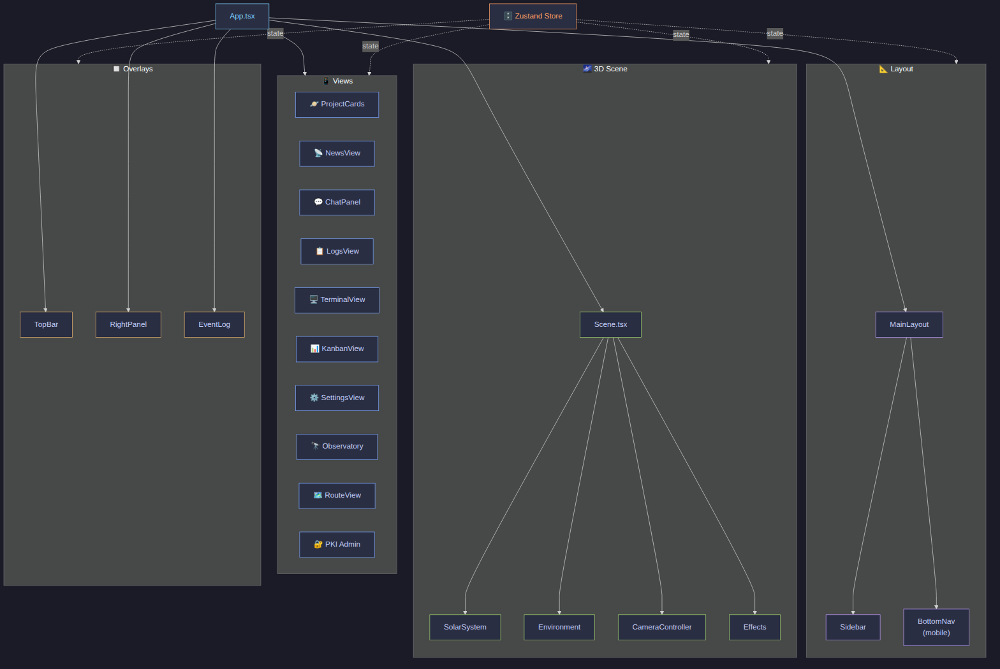
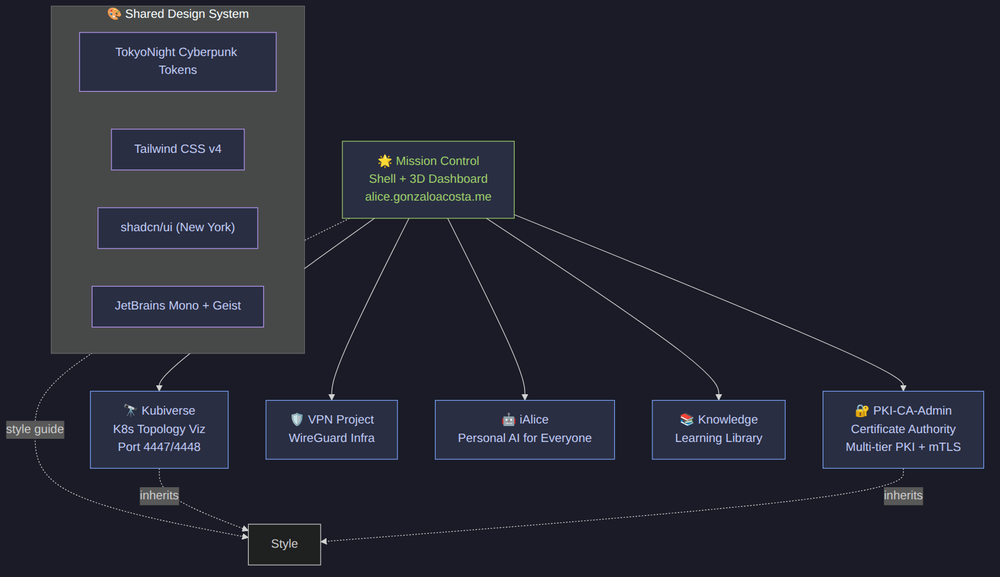

# ⬡ Alice Mission Control

A cyberpunk-themed 3D mission control dashboard for managing AI agent projects. Built with React, Three.js (React Three Fiber), and a Node.js backend with PostgreSQL persistence.

> **Live at:** [alice.gonzaloacosta.me](https://alice.gonzaloacosta.me)

## Overview

Alice Mission Control visualizes your projects as planets orbiting a central star in a 3D solar system. Each planet represents a project, and its orbiting moons represent AI agents working on tasks. The dashboard provides real-time monitoring, an integrated chat system, a web terminal, a news feed, and activity logging — all wrapped in a sci-fi HUD aesthetic.

## Architecture



### Data Flow



### Component Architecture



### Ecosystem

Mission Control is the shell for a family of sub-applications that share a unified design system.



## Features

### 🪐 3D Solar System View
- Projects rendered as colored glowing planets orbiting a central green star
- AI agents shown as moons orbiting their parent project
- Network links visualized as animated particle beams between agents
- Bloom, chromatic aberration, and vignette post-processing effects
- Click a planet to zoom in and see project details

### 📡 News Feed
- Aggregated daily news (AI, cybersecurity, Argentina, Spain, weather)
- Category filtering with color-coded badges
- Auto-refreshes every 5 minutes from `/news.json`
- Promoted to primary mobile navigation for quick access

### 💬 Chat System
- Multi-tab chat interface for interacting with project agents
- Messages persisted to PostgreSQL
- Real-time streaming via WebSocket
- Supports Claude CLI as the backend AI agent (via `node-pty`)

### 🖥️ Web Terminal
- Full xterm.js terminal in the browser
- PTY-backed via WebSocket for real-time I/O
- Runs bash on the host machine

### 📋 Activity Log
- Real-time event stream from all projects
- Severity-coded entries (INFO, WARN, ERR, CRIT)
- Per-project color coding

### ⚙️ Settings
- Graphics quality control (Low / Medium / High)
- Pause/resume simulation
- Core name and creator name display

## Tech Stack

| Layer | Technology |
|-------|-----------|
| **Frontend** | React 19, TypeScript, Vite 7 |
| **3D Engine** | Three.js via React Three Fiber + Drei |
| **Post-processing** | @react-three/postprocessing (Bloom, ChromaticAberration) |
| **Styling** | Tailwind CSS 4 + TokyoNight Cyberpunk design tokens |
| **State** | Zustand (with localStorage persistence) |
| **Terminal** | xterm.js + node-pty |
| **Chat** | WebSocket streaming + PostgreSQL persistence |
| **Backend** | Express 5 + ws (WebSocket) |
| **Database** | PostgreSQL 16 (Alpine) |
| **Testing** | Vitest + Testing Library + Playwright |
| **Container** | Docker + Docker Compose |
| **Reverse Proxy** | Caddy (+ Cloudflare for SSL/DNS) |
| **Fonts** | JetBrains Mono (body), Geist (headings) |

## Design System

The project follows the **TokyoNight Cyberpunk** design system, documented in [`FRONTEND-STYLE-GUIDE.md`](FRONTEND-STYLE-GUIDE.md).

### Color Palette

| Token | Hex | Usage |
|-------|-----|-------|
| `--background` | `#1a1b26` | Page background |
| `--card` | `#24283b` | Card / panel background |
| `--secondary` | `#292e42` | Hover state, nested surfaces |
| `--border` | `#414868` | Borders, dividers |
| `--foreground` | `#c0caf5` | Primary text |
| `--muted-foreground` | `#565f89` | Secondary text |
| `--neon-cyan` | `#7dcfff` | Primary highlight |
| `--primary` | `#7aa2f7` | Interactive elements |
| `--neon-green` | `#9ece6a` | Success, healthy |
| `--destructive` | `#f7768e` | Error, critical |
| `--neon-yellow` | `#e0af68` | Warning, pending |
| `--neon-magenta` | `#bb9af7` | PKI / crypto accent |
| `--neon-orange` | `#ff9e64` | Tertiary accent |

### Status Convention

| Status | Color | Example |
|--------|-------|---------|
| Healthy / Valid | 🟢 `#9ece6a` | Active agents, passing builds |
| Error / Failed | 🔴 `#f7768e` | Build failures, expired certs |
| Warning / Pending | 🟡 `#e0af68` | Unknown state, approaching limits |
| Info / Neutral | 🔵 `#7aa2f7` | General information |
| Highlight / Active | 🩵 `#7dcfff` | Selected items, focus state |
| Crypto / PKI | 🟣 `#bb9af7` | Certificate operations |

## Mobile Navigation

The mobile UI uses a 5-tab bottom navigation:

```
ORBIT | PROJECTS | NEWS | CHAT | MORE
                                  ↓
                         ┌─────────────┐
                         │ VIEWS       │
                         │  Kubiverse  │
                         │  Route      │
                         │             │
                         │ SYSTEM      │
                         │  Terminal   │
                         │  PKI Admin  │
                         │  Settings   │
                         └─────────────┘
```

## Development

### Prerequisites
- Node.js 22+
- Docker & Docker Compose
- pnpm (recommended) or npm

### Setup

```bash
git clone https://github.com/gonzaloacosta/alice-mission-control.git
cd alice-mission-control
npm install
npm run dev
```

### Testing

```bash
# Unit & component tests
npm test

# Watch mode
npm run test:watch

# E2E tests
npm run test:e2e
```

### Build & Deploy

```bash
# Build
npm run build

# Deploy via Docker
docker compose up -d --build
```

The app is served on port `4445` and proxied via Caddy to `alice.gonzaloacosta.me`.

## Project Structure

```
alice-mission-control/
├── src/
│   ├── components/
│   │   ├── hud/           # 2D overlay views (News, Chat, Logs, etc.)
│   │   ├── layout/        # Sidebar, MainLayout
│   │   └── scene/         # 3D scene (SolarSystem, Environment, Effects)
│   ├── store/             # Zustand state management
│   ├── styles/            # Shared design tokens
│   ├── test/              # Test setup
│   ├── types/             # TypeScript type definitions
│   ├── App.tsx            # Root component
│   └── index.css          # Global styles + design tokens
├── server/                # Express API + WebSocket server
├── data/                  # Static data (news.json)
├── docs/                  # Documentation & diagrams
│   └── diagrams/          # Architecture diagrams (PNG)
├── docker-compose.yml     # Production deployment
├── Dockerfile             # Multi-stage build (Node → nginx)
├── FRONTEND-STYLE-GUIDE.md
├── vitest.config.ts
└── README.md
```

## License

Private project.
