# ⬡ Alice Mission Control

A cyberpunk-themed 3D mission control dashboard for managing AI agent projects. Built with React, Three.js (React Three Fiber), and a Node.js backend with PostgreSQL persistence.

> **Live at:** [alice.gonzaloacosta.me](https://alice.gonzaloacosta.me)

## Overview

Alice Mission Control visualizes your projects as planets orbiting a central star in a 3D solar system. Each planet represents a project, and its orbiting moons represent AI agents working on tasks. The dashboard provides real-time monitoring, an integrated chat system, a web terminal, a news feed, and activity logging — all wrapped in a sci-fi HUD aesthetic.

```mermaid
block-beta
  columns 5

  block:sidebar:1
    columns 1
    brand["⬡ ALICE\nMission Control"]
    space
    nav["📱 Applications\n🪐 Projects\n📡 News Feed\n💬 Chat\n📋 Activity Log\n🖥️ Terminal\n⚙️ Settings\n🤖 OpenClaw"]
    space
    sessions["📡 Sessions\n● CID\n◌ VPN\n◌ MCTL\n◌ KNOWLEDGE"]
    space
    footer["🟢 Connected"]
  end

  block:main:3
    columns 1
    topbar["📊 Stats: 4 Projects | 8 Agents | 33 Events"]
    block:scene:1
      columns 1
      solar["🌟 3D Solar System\n\n🪐 CID (Auth Proxy)\n   ☾ Backend · ☾ DevOps · ☾ DevSecOps\n\n🪐 VPN (WireGuard)\n   ☾ Infra\n\n🪐 MCTL (Dashboard)\n   ☾ Fullstack\n\n🪐 KNOWLEDGE (Library)\n   ☾ Curator"]
    end
  end

  block:right:1
    columns 1
    detail["📋 Project Detail\n\nName\nProgress\nVersion\nStatus\n\n👥 Agents\n📊 Tasks\n🔗 Links"]
  end

  style brand fill:#0a0e1a,stroke:#00f0ff,color:#00f0ff
  style nav fill:#0a0e1a,stroke:#1a2a3a,color:#8a9aaa
  style sessions fill:#0a0e1a,stroke:#1a2a3a,color:#6a7a8a
  style footer fill:#0a0e1a,stroke:#1a2a3a,color:#00ff88
  style topbar fill:#0a0e1a,stroke:#00f0ff,color:#00f0ff
  style solar fill:#0a0e1a,stroke:#1a2a3a,color:#c8d8e8
  style detail fill:#0a0e1a,stroke:#1a2a3a,color:#8a9aaa
```



## Features

### 🪐 3D Solar System View
- Projects rendered as glowing planets orbiting a central star
- AI agents shown as moons orbiting their parent project
- Network links visualized as animated particle beams between agents
- Bloom, chromatic aberration, and vignette post-processing effects
- Click a planet to zoom in and see project details

### 📡 News Feed
- Aggregated daily news (AI, cybersecurity, Argentina, Spain, weather)
- Category filtering with color-coded badges
- Auto-refreshes every 5 minutes from `/news.json`
- Populated by a cron job (OpenClaw morning briefing)

### 💬 Chat System
- Multi-tab chat interface for interacting with project agents
- Messages persisted to PostgreSQL
- Real-time streaming via WebSocket
- Supports Claude CLI as the backend AI agent (via `node-pty`)

### 🖥️ Web Terminal
- Full xterm.js terminal in the browser
- PTY-backed via WebSocket for real-time I/O
- Runs bash on the host machine

### 📋 Activity Log
- Real-time event stream from all projects
- Severity-coded entries (INFO, WARN, ERR, CRIT)
- Per-project color coding

### ⚙️ Settings
- Graphics quality control (Low / Medium / High)
- Pause/resume simulation
- Core name and creator name display

## Architecture

```mermaid
graph TB
  subgraph Internet
    USER["🌐 User Browser"]
    CF["☁️ Cloudflare\nSSL + DNS\nalice.gonzaloacosta.me"]
  end

  subgraph Host["🖥️ Host Server"]
    CADDY["🔒 Caddy\nReverse Proxy\nPort 80/443"]

    subgraph Docker["🐳 Docker Compose"]
      NGINX["📦 mission-control\nnginx:alpine\nPort 4445"]
      PG["🐘 postgres\npostgres:16-alpine\nPort 5432 (localhost)"]
      API["⚡ API Server\nNode.js + Express\nPort 4446"]
    end

    NEWS["📄 data/news.json\n(volume mount)"]
  end

  USER -->|HTTPS| CF
  CF -->|HTTP| CADDY
  CADDY -->|proxy_pass :4445| NGINX
  NGINX -->|/api/* proxy| API
  NGINX -->|/ws/* proxy| API
  API -->|chat persistence| PG
  API -->|"PTY: claude + bash"| PTY["🖥️ node-pty"]
  NEWS -.->|read-only mount| NGINX

  style CF fill:#f6821f,stroke:#f6821f,color:#fff
  style NGINX fill:#009639,stroke:#009639,color:#fff
  style PG fill:#336791,stroke:#336791,color:#fff
  style API fill:#68a063,stroke:#68a063,color:#fff
  style CADDY fill:#00a7e1,stroke:#00a7e1,color:#fff
  style Docker fill:#0d1117,stroke:#1f6feb,color:#c9d1d9
  style Host fill:#161b22,stroke:#30363d,color:#c9d1d9
```



### Data Flow

```mermaid
graph LR
  subgraph Frontend["⚛️ React App"]
    STORE["🗄️ Zustand Store"]
    R3F["🪐 React Three Fiber\n3D Solar System"]
    HUD["📊 HUD Components\nNews · Chat · Logs · Terminal"]
    XTERM["🖥️ xterm.js"]
  end

  subgraph Backend["⚡ API Server"]
    REST["REST /api/v1/*"]
    WS["WebSocket /ws/*"]
    PTY2["node-pty"]
  end

  subgraph Storage
    PGSQL["🐘 PostgreSQL\nchat_messages"]
    NJSON["📄 news.json"]
  end

  HUD -->|fetch| REST
  HUD -->|stream| WS
  XTERM -->|stdin/stdout| WS
  WS -->|spawn| PTY2
  REST -->|CRUD| PGSQL
  NJSON -->|static serve| HUD
  STORE --- R3F
  STORE --- HUD

  style Frontend fill:#0d1117,stroke:#1f6feb,color:#c9d1d9
  style Backend fill:#0d1117,stroke:#238636,color:#c9d1d9
  style Storage fill:#0d1117,stroke:#f78166,color:#c9d1d9
```



### Tech Stack

| Layer | Technology |
|-------|-----------|
| **Frontend** | React 19, TypeScript, Vite |
| **3D Engine** | Three.js via React Three Fiber + Drei |
| **Post-processing** | @react-three/postprocessing (Bloom, ChromaticAberration) |
| **Styling** | Tailwind CSS 4 + custom cyberpunk CSS |
| **State** | Zustand (with localStorage persistence) |
| **Terminal** | xterm.js + node-pty |
| **Chat** | WebSocket streaming + PostgreSQL persistence |
| **Backend** | Express 5 + ws (WebSocket) |
| **Database** | PostgreSQL 16 (Alpine) |
| **Container** | Docker + Docker Compose |
| **Reverse Proxy** | Caddy (+ Cloudflare for SSL/DNS) |
| **Fonts** | Orbitron (headings), Share Tech Mono (body) |

### Component Architecture

```mermaid
graph TD
  APP["App.tsx"]

  subgraph Layout
    ML["MainLayout"]
    SB["Sidebar"]
  end

  subgraph Views["Overlay Views"]
    PV["🪐 ProjectCards"]
    NV["📡 NewsView"]
    CP["💬 ChatPanel"]
    LV["📋 LogsView"]
    TV["🖥️ TerminalView"]
    SV["⚙️ SettingsView"]
    OC["🤖 OpenClaw Admin"]
  end

  subgraph Scene["3D Scene (always rendered)"]
    SC["Scene.tsx"]
    SS["SolarSystem"]
    AI["AgentInstances"]
    NL["NetworkLinks"]
    ENV["Environment"]
    CC["CameraController"]
    FX["Effects"]
  end

  subgraph Overlays["Floating Panels"]
    TB["TopBar"]
    RP["RightPanel"]
  end

  APP --> ML
  ML --> SB
  APP --> SC
  APP --> TB
  APP --> RP
  APP --> Views

  SC --> SS
  SC --> AI
  SC --> NL
  SC --> ENV
  SC --> CC
  SC --> FX

  STORE["🗄️ Zustand Store"] -.->|state| SB
  STORE -.->|state| Views
  STORE -.->|state| Scene
  STORE -.->|state| Overlays

  style APP fill:#00f0ff,stroke:#00f0ff,color:#000
  style STORE fill:#ff8800,stroke:#ff8800,color:#000
  style Scene fill:#0d1117,stroke:#00ff88,color:#c9d1d9
  style Views fill:#0d1117,stroke:#00f0ff,color:#c9d1d9
  style Layout fill:#0d1117,stroke:#aa44ff,color:#c9d1d9
  style Overlays fill:#0d1117,stroke:#ffcc00,color:#c9d1d9
```



### Project Structure

```
alice-mission-control/
├── src/
│   ├── main.tsx                    # App entry point
│   ├── App.tsx                     # Root component + view routing
│   ├── App.css                     # Global cyberpunk styles
│   ├── index.css                   # Base styles + fonts
│   ├── store/
│   │   └── index.ts                # Zustand store (projects, events, chat, UI)
│   ├── types/
│   │   └── index.ts                # TypeScript types (Project, Agent, Event)
│   ├── components/
│   │   ├── layout/
│   │   │   ├── Sidebar.tsx         # Navigation sidebar + session list
│   │   │   └── MainLayout.tsx      # Sidebar + content wrapper
│   │   ├── scene/
│   │   │   ├── Scene.tsx           # R3F Canvas + lighting
│   │   │   ├── SolarSystem.tsx     # Planets, orbits, moons
│   │   │   ├── AgentInstances.tsx  # Instanced agent meshes
│   │   │   ├── NetworkLinks.tsx    # Animated particle links
│   │   │   ├── CameraController.tsx# Orbital camera + zoom-to-project
│   │   │   ├── Environment.tsx     # Stars, nebula, ambient particles
│   │   │   └── Effects.tsx         # Post-processing pipeline
│   │   └── hud/
│   │       ├── TopBar.tsx          # Stats bar (projects, agents, events)
│   │       ├── RightPanel.tsx      # Slide-in project detail panel
│   │       ├── ChatPanel.tsx       # Multi-tab chat with agents
│   │       ├── NewsView.tsx        # News feed with category filters
│   │       ├── LogsView.tsx        # Event log stream
│   │       ├── TerminalView.tsx    # Web terminal (xterm.js)
│   │       ├── SettingsView.tsx    # Quality + pause controls
│   │       ├── ProjectCards.tsx    # Grid view of project cards
│   │       ├── ProjectDetail.tsx   # Detailed project view
│   │       ├── InsightsView.tsx    # System-wide analytics
│   │       ├── EventLog.tsx        # Compact event list
│   │       └── BottomNav.tsx       # (Legacy) bottom navigation
│   └── services/
│       └── mock.ts                 # Mock data generators
├── server/
│   ├── index.js                    # Express + WebSocket server
│   ├── config.js                   # Project directory mapping
│   ├── db.js                       # PostgreSQL client
│   └── schema.sql                  # chat_messages table
├── public/
│   ├── news.json                   # Default news feed (overridden by volume mount)
│   └── favicon.svg
├── data/
│   └── news.json                   # Live news data (mounted into container)
├── docker-compose.yml              # Container orchestration
├── Dockerfile                      # Multi-stage build (node → nginx)
├── nginx.conf                      # SPA routing + static asset caching
├── vite.config.ts                  # Dev server + API proxy config
├── index.html                      # HTML entry point
└── package.json
```

## Installation

### Prerequisites

- **Docker** and **Docker Compose** (recommended)
- Or: **Node.js 22+** and **PostgreSQL 16+** for local development

### Quick Start (Docker)

```bash
# Clone the repository
git clone https://github.com/gonzaloacosta/alice-mission-control.git
cd alice-mission-control

# Create the data directory for live news
mkdir -p data
cp public/news.json data/news.json

# Build and start
docker compose up -d

# Access at http://localhost:4445
```

### Local Development

```bash
# Install frontend dependencies
npm install

# Install server dependencies
cd server && npm install && cd ..

# Start PostgreSQL (if not using Docker)
docker run -d --name mc-postgres \
  -e POSTGRES_DB=alice_mc \
  -e POSTGRES_USER=alice \
  -e POSTGRES_PASSWORD=alice_mc_2026 \
  -p 5432:5432 \
  postgres:16-alpine

# Start the API server (in one terminal)
cd server && node index.js

# Start the dev server (in another terminal)
npm run dev
# → http://localhost:4444 (with HMR + API proxy to :4446)
```

### Build for Production

```bash
# Build the frontend
npx vite build    # outputs to dist/

# Or rebuild the Docker image
docker compose up -d --build
```

## Configuration

### Environment Variables

| Variable | Default | Description |
|----------|---------|-------------|
| `VITE_CORE_NAME` | `ALICE` | Name displayed in the sidebar header |
| `VITE_CREATOR_NAME` | `Gonzalo` | Creator name shown in settings |

### Project Configuration

Edit `server/config.js` to add/modify projects:

```javascript
const PROJECTS = {
  myproject: {
    dir: '/path/to/project',
    agents: ['backend', 'frontend']  // or auto-detected from .claude/agents/
  },
};
```

Agents are auto-discovered from `.claude/agents/*.md` files in the project directory.

### Adding Projects to the 3D View

Edit the `INITIAL_PROJECTS` array in `src/store/index.ts`:

```typescript
{
  id: 'myproject',
  name: 'MY PROJECT',
  description: 'What it does',
  color: '#ff8800',           // Planet color
  emissiveColor: '#ff8800',   // Glow color
  progress: 0.5,              // 0-1
  version: 'v0.1.0',
  status: 'building',         // 'building' | 'orbiting'
  orbitRadius: 20,            // Distance from center
  orbitSpeed: 0.04,           // Angular velocity
  size: 2.0,                  // Planet scale
  startAngle: 1.5,            // Initial orbit position (radians)
  tasks: { done: 5, total: 10 },
  agents: [
    { id: 'agent-1', name: 'Backend', role: 'Go API', state: 'active',
      task: 'Building endpoints', contribution: 0.7 },
  ],
  repoUrl: 'https://github.com/user/repo',
  notionUrl: 'https://notion.so/...',
}
```

### News Feed

The news panel reads from `/news.json`. To update it:

```bash
# Write directly to the mounted data file
cat > data/news.json << 'EOF'
{
  "updatedAt": "2026-02-18T07:00:00+01:00",
  "items": [
    {
      "id": "unique-id",
      "category": "ai",
      "headline": "Breaking: New AI model released",
      "summary": "Details about the release...",
      "source": "TechCrunch",
      "sourceTag": "🟢 Center",
      "url": "https://example.com/article",
      "timestamp": "2026-02-18"
    }
  ]
}
EOF
```

**Supported categories:** `ai`, `cybersec`, `argentina`, `spain`, `weather`, `tech`, `world`

The file is mounted read-only into the container, so edits on the host are reflected immediately.

### Reverse Proxy (Caddy)

Example Caddyfile for exposing behind a domain:

```
app.yourdomain.com {
    reverse_proxy localhost:4445
}
```

With Cloudflare: set SSL mode to **Flexible** if Caddy doesn't terminate TLS, or **Full** if it does.

## API Reference

The API server runs on port `4446` (proxied through Vite in dev on `:4444`).

### Projects

| Method | Endpoint | Description |
|--------|----------|-------------|
| `GET` | `/api/v1/projects` | List all configured projects |
| `POST` | `/api/v1/projects/:id/prompt` | Send a prompt to Claude for a project |
| `GET` | `/api/v1/projects/:id/sessions` | List recent sessions for a project |
| `POST` | `/api/v1/sessions/:id/stop` | Stop a running Claude session |

### Chat (Persistent)

| Method | Endpoint | Description |
|--------|----------|-------------|
| `GET` | `/api/v1/chat/:projectId/:agentName` | Get chat history |
| `POST` | `/api/v1/chat/:projectId/:agentName` | Save a message |
| `DELETE` | `/api/v1/chat/:projectId/:agentName` | Clear chat history |

### Terminal

| Method | Endpoint | Description |
|--------|----------|-------------|
| `POST` | `/api/v1/terminal` | Create a new terminal session |
| `GET` | `/api/v1/terminal/sessions` | List active terminals |
| `DELETE` | `/api/v1/terminal/:sessionId` | Kill a terminal session |

### WebSocket

| Endpoint | Description |
|----------|-------------|
| `ws://host:4446/ws/:sessionId` | Stream Claude session output |
| `ws://host:4446/ws/terminal/:sessionId` | Interactive terminal I/O |

## Development

### Key Commands

```bash
npm run dev       # Start dev server with HMR (port 4444)
npm run build     # Type-check + production build
npm run lint      # ESLint
npm run preview   # Preview production build locally
```

### Adding a New Sidebar View

1. Create `src/components/hud/MyView.tsx`
2. Add the view ID to the `View` type in `src/components/layout/Sidebar.tsx`
3. Add the nav item to `navItems` array in `Sidebar.tsx`
4. Add the render block in `src/App.tsx`

## License

Private project. Not for redistribution.

---

Built with ❤️ by [Gonzalo Acosta](https://github.com/gonzaloacosta) & [Alice](https://github.com/gonzaloacosta/alice-mission-control) 🤖
